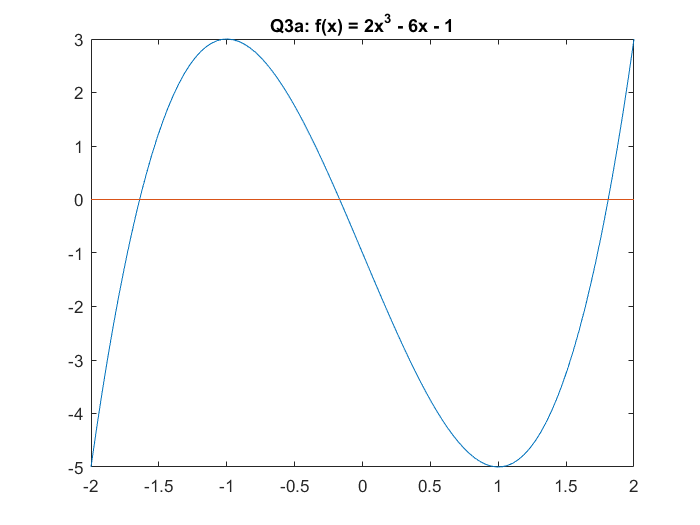
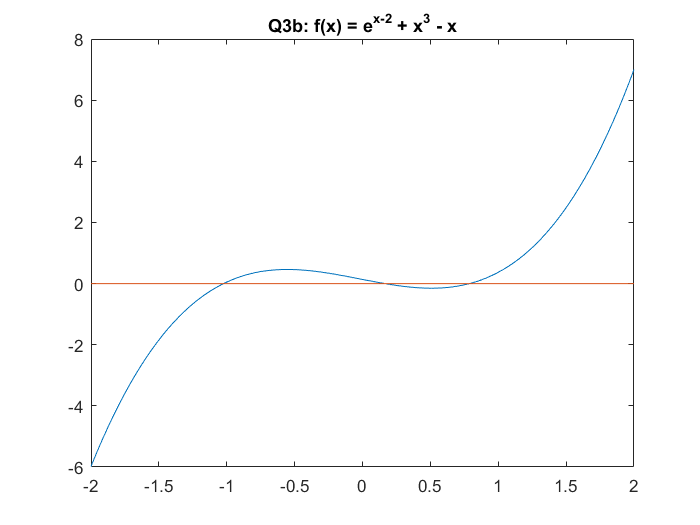
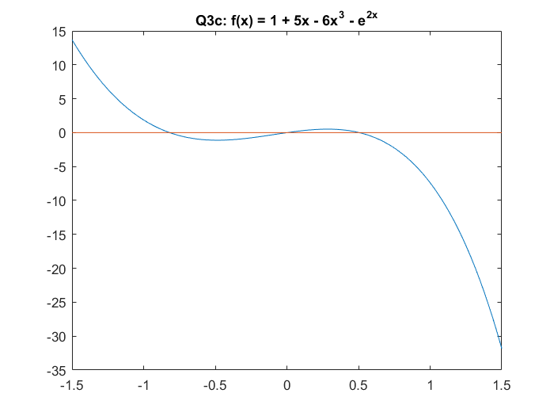

# MATH 446: Project 01
### Zachary Ferguson

## Contents

1. Code
    1. Bisection Method
    2. Fixed Point Iterative Method
    3. Main
2. Output
3. Plots

## Code

### Bisection Method

```matlab
% Computes the root of a function using the bisection method.
% Written by Zachary Ferguson

function r = bisection_method(f, a, b, tol)
    % Finds the root of the function, f, in the interval [a, b] within an
    % absolute tolerance.
    if nargin < 4
        tol = 1e-7;
    end
    assert(f(a) * f(b) <= 0);

    n = 0;
    while (abs(b - a) / 2.0) > (0.5 * tol)
        c = (a + b) / 2.0;
        if (f(c) == 0)
            break;
        end

        if (f(a) * f(c) <= 0)
            b = c;
        else
            a = c;
        end
        n = n + 1;
    end
    fprintf('\tn = %d\n', n);
    r = (a + b) / 2.0;
end
```

### Fixed Point Iterative Method

```matlab
% Computes the fixed point of a function using the FPI.
% Written by Zachary Ferguson

function xc = fixed_point_iteration(g, x0, tol)
    % Compute the fixed point of g(x).
    % Input:
    %   g - function to solve for the fixed point.
    %   x0 - initial guess
    %   tol - solution tolerance
    % Output:
    %   xc - computed root to the function g(x) = x.
    if nargin < 3
        tol = 1e-9;
    end

    prev_x = x0;
    x = g(x0);
    n = 1;
    while (abs(prev_x - x) > 0.5 * tol)
        prev_x = x;
        x = g(x);
        n = n + 1;
    end
    fprintf('\tn = %d\n', n);
    xc = x;
end
```

### Main

```matlab
% MATH 446: Project 01
% Written by Zachary Ferguson

function main()
    fprintf('MATH 446: Project 01\nWritten by Zachary Ferguson\n\n')

    fprintf('Bisection Method:\n\n')

    %%%%%%%%%%%%%%%%%%%%%%%%%%%%%%%%%%%%%%%%%%%%%%%%%%%%%%%%%%%%%%%%%%%%%%
    % Q1a
    fprintf('Q1a:\n\tf(x) = x^3 - 9\n');
    f = @(x) x^3 - 9;
    r = bisection_method(f, 2, 3);
    fprintf('\tr = %.10f\n', r);
    y = 3^(2. / 3.);
    print_errors(f, r, y);

    %%%%%%%%%%%%%%%%%%%%%%%%%%%%%%%%%%%%%%%%%%%%%%%%%%%%%%%%%%%%%%%%%%%%%%
    % Q1b
    fprintf('Q1b:\n\tf(x) = 3x^3 + x^2 - x - 5\n');
    f = @(x) 3 * x^3 + x^2 - x - 5;
    r = bisection_method(f, 1, 2);
    fprintf('\tr = %.10f\n', r);
    y = (1. / 9. * (-1 + (593 - 27 * (481^0.5))^(1.0 / 3.0) + ...
        (593 + 27 * (481^0.5))^(1.0 / 3.0)));
    print_errors(f, r, y);

    %%%%%%%%%%%%%%%%%%%%%%%%%%%%%%%%%%%%%%%%%%%%%%%%%%%%%%%%%%%%%%%%%%%%%%
    % Q1c
    fprintf('Q1c:\n\tf(x) = cos^2(x) - x + 6\n');
    f = @(x) cos(x) * cos(x) - x + 6;
    r = bisection_method(f, 6, 7);
    fprintf('\tr = %.10f\n', r);
    y = 6.7760923163195023262;
    print_errors(f, r, y);

    %%%%%%%%%%%%%%%%%%%%%%%%%%%%%%%%%%%%%%%%%%%%%%%%%%%%%%%%%%%%%%%%%%%%%%
    % Q3a
    fprintf('Q3a:\n\tf(x) = 2x^3 - 6x - 1\n');
    f = @(x) 2.0 * x.^3 - 6 * x - 1;

    x = linspace(-2, 2);
    y = f(x);
    figure;
    plot(x, y, x, 0*y);
    title('Q3a: f(x) = 2x^3 - 6x - 1');

    fprintf('\n\ta, b = -2, -1\n');
    r = bisection_method(f, -2, -1);
    fprintf('\tr1 = %.10f\n', r);
    y = -1.64178352745293;
    print_errors(f, r, y);

    fprintf('\n\ta, b = -1, 0\n');
    r = bisection_method(f, -1, 0);
    fprintf('\tr2 = %.10f\n', r);
    y = -0.168254401781027;
    print_errors(f, r, y);

    fprintf('\n\ta, b = 1, 2\n');
    r = bisection_method(f, 1, 2);
    fprintf('\tr3 = %.10f\n', r);
    y = 1.81003792923395;
    print_errors(f, r, y);

    %%%%%%%%%%%%%%%%%%%%%%%%%%%%%%%%%%%%%%%%%%%%%%%%%%%%%%%%%%%%%%%%%%%%%%
    % Q3b
    fprintf('Q3b:\n\tf(x) = e^(x-2) + x^3 - x\n');
    f = @(x) exp(x - 2) + x.^3 - x;

    x = linspace(-2, 2);
    y = f(x);
    figure;
    plot(x, y, x, 0*y);
    title('Q3b: f(x) = e^{x-2} + x^3 - x');

    fprintf('\n\ta, b = -2, -1\n');
    r = bisection_method(f, -2, -1);
    fprintf('\tr1 = %.10f\n', r);
    y = -1.0234821948582364944;
    print_errors(f, r, y);

    fprintf('\n\ta, b = -0.5, -0.5\n');
    r = bisection_method(f, -0.5, 0.5);
    fprintf('\tr2 = %.10f\n', r);
    y = 0.16382224325010849634;
    print_errors(f, r, y);

    fprintf('\n\ta, b = 0.5, 1.5\n');
    r = bisection_method(f, 0.5, 1.5);
    fprintf('\tr3 = %.10f\n', r);
    y = 0.78894138905554556637;
    print_errors(f, r, y);

    %%%%%%%%%%%%%%%%%%%%%%%%%%%%%%%%%%%%%%%%%%%%%%%%%%%%%%%%%%%%%%%%%%%%%%
    % Q3c
    fprintf('Q3c:\n\tf(x) = 1 + 5x - 6x^3 - e^(2x)\n');
    f = @(x) 1 + 5 * x - 6 * x.^3 - exp(2 * x);

    x = linspace(-1.5, 1.5);
    y = f(x);
    figure;
    plot(x, y, x, 0*y);
    title('Q3c: f(x) = 1 + 5x - 6x^3 - e^{2x}');

    fprintf('\n\ta, b = -1.5, -0.5\n');
    r = bisection_method(f, -1.5, -0.5);
    fprintf('\tr1 = %.10f\n', r);
    y = -0.81809373448119542124;
    print_errors(f, r, y);

    fprintf('\n\ta, b = -0.6, 0.4\n');
    r = bisection_method(f, -0.6, 0.4);
    fprintf('\tr2 = %.10f\n', r);
    y = 0.0;
    print_errors(f, r, y);

    fprintf('\n\ta, b = 0.5, 1.5\n');
    r = bisection_method(f, 0.5, 1.5);
    fprintf('\tr3 = %.10f\n', r);
    y = 0.50630828634622119599;
    print_errors(f, r, y);

    %%%%%%%%%%%%%%%%%%%%%%%%%%%%%%%%%%%%%%%%%%%%%%%%%%%%%%%%%%%%%%%%%%%%%%
    % Q4a
    fprintf('Q4a:\n\tf(x) = x^2 - A\n');
    fprintf('\tA = 2, (a, b) = (1, 2)\n');
    A = 2;
    f = @(x) x^2 - A;
    r = bisection_method(f, 1, 2);
    fprintf('\tr = %.10f\n', r);
    y = 2^0.5;
    print_errors(f, r, y);

    %%%%%%%%%%%%%%%%%%%%%%%%%%%%%%%%%%%%%%%%%%%%%%%%%%%%%%%%%%%%%%%%%%%%%%
    % Q4c
    fprintf('Q4b:\n\tA = 3, (a, b) = (1, 2)\n');
    A = 3;
    f = @(x) x^2 - A;
    r = bisection_method(f, 1, 2);
    fprintf('\tr = %.10f\n', r);
    y = 3^0.5;
    print_errors(f, r, y);

    %%%%%%%%%%%%%%%%%%%%%%%%%%%%%%%%%%%%%%%%%%%%%%%%%%%%%%%%%%%%%%%%%%%%%%
    % Q4c
    fprintf('Q4c:\n\tA = 5, (a, b) = (2, 3)\n');
    A = 5;
    f = @(x) x^2 - A;
    r = bisection_method(f, 2, 3);
    fprintf('\tr = %.10f\n', r);
    y = 5^0.5;
    print_errors(f, r, y);

    %%%%%%%%%%%%%%%%%%%%%%%%%%%%%%%%%%%%%%%%%%%%%%%%%%%%%%%%%%%%%%%%%%%%%%%
    % Fixed Point Iteration
    fprintf('\nFixed Point Iteration:\n\n');

    fprintf('Q1a:\n\tg(x) = (2x+2)^(1/3) = x\n');
    fprintf('\txc = %.10f\n', fixed_point_iteration(...
        @(x)(2 * x + 2)^(1 / 3.), 2));

    fprintf('Q1b:\n\tg(x) = ln(7-x) = x\n');
    fprintf('\txc = %.10f\n', fixed_point_iteration(@(x) log(7 - x), 2));

    fprintf('Q1c:\n\tg(x) = ln(4-sin(x)) = x\n');
    fprintf('\txc = %.10f\n', ...
        fixed_point_iteration(@(x) log(4 - sin(x)), 2));

    A = 3.;
    g = @(x) (x + A / x) / 2.;
    fprintf('Q3a:\n\tg(x) = (x + 3 / x) / 2\n');
    fprintf('\tx0 = 2\n');
    fprintf('\txc = %.10f\n', fixed_point_iteration(g, 2));

    A = 5.;
    g = @(x) (x + A / x) / 2.;
    fprintf('Q3b:\n\tg(x) = (x + 5 / x) / 2\n');
    fprintf('\tx0 = 2\n');
    fprintf('\txc = %.10f\n', fixed_point_iteration(g, 2));

    fprintf('Q5:\n\tg(x) = cos^2(x)\n');
    xc = fixed_point_iteration(@(x) (cos(x))^2, 1, 1e-6);
    fprintf('\txc = %.10f\n', xc);
    fprintf('\n\td/dx g(x) = -2*cos(x)*sin(x)\n');
    fprintf('\t|d/dx g(xc)| = %.10f\n', abs(-2 * cos(xc) * sin(xc)));
    fprintf('\tTherefore g(x) is locally convergent to xc.\n');
end

% Print the forward and backward error of r.
function print_errors(f, r, y)
    fprintf('\tForward error: %.10f\n', abs(y - r))
    fprintf('\tBackward error: %.10f\n', abs(f(r)))
end
```

## Output

```
MATH 446: Project 01
Written by Zachary Ferguson

Bisection Method:

Q1a:
	f(x) = x^3 - 9
	n = 24
	r = 2.0800838172
	Forward error: 0.0000000058
	Backward error: 0.0000000754
Q1b:
	f(x) = 3x^3 + x^2 - x - 5
	n = 24
	r = 1.1697262228
	Forward error: 0.0000000029
	Backward error: 0.0000000396
Q1c:
	f(x) = cos^2(x) - x + 6
	n = 24
	r = 6.7760923207
	Forward error: 0.0000000044
	Backward error: 0.0000000080
Q3a:
	f(x) = 2x^3 - 6x - 1

	a, b = -2, -1
	n = 24
	r1 = -1.6417835057
	Forward error: 0.0000000218
	Backward error: 0.0000002215

	a, b = -1, 0
	n = 24
	r2 = -0.1682544053
	Forward error: 0.0000000035
	Backward error: 0.0000000203

	a, b = 1, 2
	n = 24
	r3 = 1.8100379407
	Forward error: 0.0000000115
	Backward error: 0.0000001572
Q3b:
	f(x) = e^(x-2) + x^3 - x

	a, b = -2, -1
	n = 24
	r1 = -1.0234821737
	Forward error: 0.0000000212
	Backward error: 0.0000000464

	a, b = -0.5, -0.5
	n = 24
	r2 = 0.1638222635
	Forward error: 0.0000000202
	Backward error: 0.0000000154

	a, b = 0.5, 1.5
	n = 24
	r3 = 0.7889414132
	Forward error: 0.0000000241
	Backward error: 0.0000000281
Q3c:
	f(x) = 1 + 5x - 6x^3 - e^(2x)

	a, b = -1.5, -0.5
	n = 24
	r1 = -0.8180937469
	Forward error: 0.0000000124
	Backward error: 0.0000000924

	a, b = -0.6, 0.4
	n = 24
	r2 = -0.0000000060
	Forward error: 0.0000000060
	Backward error: 0.0000000179

	a, b = 0.5, 1.5
	n = 24
	r3 = 0.5063082874
	Forward error: 0.0000000010
	Backward error: 0.0000000053
Q4a:
	f(x) = x^2 - A
	A = 2, (a, b) = (1, 2)
	n = 24
	r = 1.4142135680
	Forward error: 0.0000000056
	Backward error: 0.0000000158
Q4b:
	A = 3, (a, b) = (1, 2)
	n = 24
	r = 1.7320508063
	Forward error: 0.0000000013
	Backward error: 0.0000000045
Q4c:
	A = 5, (a, b) = (2, 3)
	n = 24
	r = 2.2360679805
	Forward error: 0.0000000030
	Backward error: 0.0000000135

Fixed Point Iteration:

Q1a:
	g(x) = (2x+2)^(1/3) = x
	n = 14
	xc = 1.7692923543
Q1b:
	g(x) = ln(7-x) = x
	n = 14
	xc = 1.6728216987
Q1c:
	g(x) = ln(4-sin(x)) = x
	n = 10
	xc = 1.1299804987
Q3a:
	g(x) = (x + 3 / x) / 2
	x0 = 2
	n = 5
	xc = 1.7320508076
Q3b:
	g(x) = (x + 5 / x) / 2
	x0 = 2
	n = 4
	xc = 2.2360679775
Q5:
	g(x) = cos^2(x)
	n = 325
	xc = 0.6417141321

	d/dx g(x) = -2*cos(x)*sin(x)
	|d/dx g(xc)| = 0.9589931641
	Therefore g(x) is locally convergent to xc.
```

## Plots






