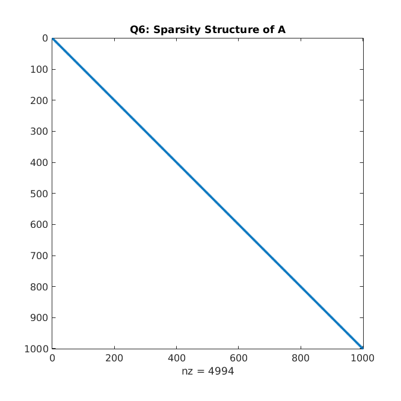
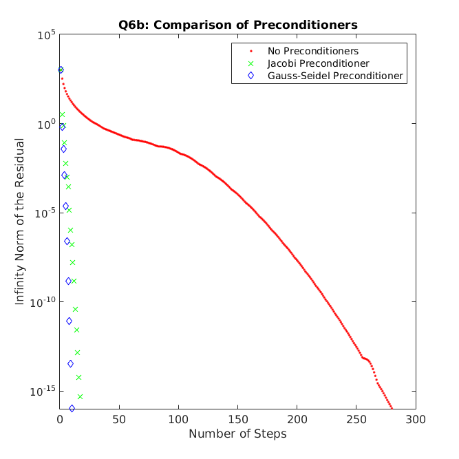

# MATH 446: Project 08

**Zachary Ferguson**

**March 28, 2017**

## Contents

1. Code
    1. Conjugate Gradient Method
    2. Main
2. Output
3. Figures

## Code

### Conjugate Gradient Method

```matlab
% Solve a system of linear equations, Ax = b, using the Conjugate Gradient
% Method
% Written by Zachary Ferguson

function xc = conjugate_gradient_method(A, b, x0, M, disp_figure, disp_prop)
    % Solve the equation Ax = b using the Conjugate Gradient Method
    % Input:
    %   A - matrix of coefficients to the linear equations
    %   b - Right hand side of the linear equations
    %   x0 - intial guess for solution vector
    %   M - optional preconditioner matrix (Default: Identity)
    % Output:
    %   xc - computed solution to a eps tolerance
    n = size(A, 1);
    if nargin < 4
        M = speye(n);
    end
    if nargin < 5
        disp_figure = false;
    end

    xc = x0; % Computed solution
    r = b - A*x0; % Residual
    d = M \ r; % Direction
    z = d;
    errors = [];
    for k = 0 : (n-1)
        val_r = norm(r, inf);
        errors = [errors val_r];
        if val_r <= 1e-16
            break
        end
        Ad = A * d;
        alpha = (r' * z) / (d' * Ad);
        xc = xc + alpha * d;
        r_prev = r;
        r = r - alpha * Ad;
        z_prev = z;
        z = M \ r; % M^-1 * r
        beta = (r' * z) / (r_prev' * z_prev);
        d = z + beta * d;
    end
    if disp_figure
        semilogy(1:size(errors, 2), errors, disp_prop)
    end
    fprintf('\tNumber of steps to find solution: %d\n', k+1);
end
```

### Main

```matlab
% MATH 446: Project 08
% Written by Zachary Ferguson

function main()
    fprintf('MATH 446: Project 08\nWritten by Zachary Ferguson\n\n');

    % Question 02
    fprintf('Q2a:\n');
    A = [1 -1 0 ; -1 2 1 ; 0 1 2];
    b = [0 ; 2 ; 3];
    xc = conjugate_gradient_method(A, b, zeros(3, 1));
    fprintf('\txc =\n');
    disp(xc);
    print_errors(A, b, [1 ; 1 ; 1], xc);

    fprintf('Q2b:\n');
    A = [1 -1 0 ; -1 2 1 ; 0 1 5];
    b = [3 ; -3 ; 4];
    xc = conjugate_gradient_method(A, b, zeros(3, 1));
    fprintf('\txc =\n');
    disp(xc);
    print_errors(A, b, [2 ; -1 ; 1], xc);

    % Question 05
    fprintf('\nQ5a:\n\tn=100\n');
    n = 100;
    [A, b] = build_Q5_system(n);
    xc = conjugate_gradient_method(A, b, zeros(n, 1));
    print_errors(A, b, ones(n, 1), xc);

    fprintf('\nQ5b:\n\tn=1000\n');
    n = 1000;
    [A, b] = build_Q5_system(n);
    xc = conjugate_gradient_method(A, b, zeros(n, 1));
    print_errors(A, b, ones(n, 1), xc);

    fprintf('\nQ5c:\n\tn=10000\n');
    n = 10000;
    [A, b] = build_Q5_system(n);
    xc = conjugate_gradient_method(A, b, zeros(n, 1));
    print_errors(A, b, ones(n, 1), xc);

    % Question 06
    fprintf('\nQ6:\n\tn=1000\n');
    n = 1000;
    [A, b] = build_Q6_system(n);
    figure;
    spy(A);
    title('Q6: Sparsity Structure of A');
    fprintf('Q6a:\n\tSee figures for sparsity structure of A.\n');

    fprintf('Q6b:\n');
    figure;
    fprintf('No Preconditioner:\n\n');
    xc = conjugate_gradient_method(A, b, zeros(n, 1), speye(n), true, '.r');
    print_errors(A, b, ones(n, 1), xc);
    hold on;

    fprintf('\nJacobi Preconditioner:\n\n');
    D = spdiags(spdiags(A, 0), 0, n, n);
    xc = conjugate_gradient_method(A, b, zeros(n, 1), D, true, 'xg');
    print_errors(A, b, ones(n, 1), xc);
    hold on;

    fprintf('\nGass-Seidel Preconditioner:\n');
    U = triu(A, 1);
    L = tril(A, -1);
    Dinv = D^-1;
    xc = conjugate_gradient_method(A, b, zeros(n, 1), A + L * Dinv * U, true, 'db');
    print_errors(A, b, ones(n, 1), xc);

    title('Q6b: Comparison of Preconditioners');
    legend('No Preconditioners', 'Jacobi Preconditioner', ...
        'Gauss-Seidel Preconditioner');
    xlabel('Number of Steps');
    ylabel('Infinity Norm of the Residual');
    ylim([1e-16 1e5])
    hold off;
end

function [A, b] = build_Q5_system(n)
    % Helper function to build A and b for question 5.
    diag_elements = [[-1 * ones(n-1, 1); 0], 3*ones(n, 1), ...
        [[0; -1 * ones(n-1, 1)]]];
    diag_indices = [-1; 0; 1];
    A = spdiags(diag_elements, diag_indices, n, n);
    tmp = flip(0.5 * speye(n));
    tmp(ceil(n/2) + 1, ceil(n/2)) = 0;
    tmp(ceil(n/2), ceil(n/2) + 1) = 0;
    A = A + tmp;

    b = [2.5; 1.5 * ones(ceil(n/2 - 2), 1); 1 ; 1 ; ...
        1.5 * ones(ceil(n/2 - 2), 1); 2.5];
end

function [A, b] = build_Q6_system(n)
    % Helper function that builds A and b for Question 6.
    diag_elements = [[0.5 * ones(n-2, 1); 0; 0], [0.5 * ones(n-1, 1); 0], ...
        (1:n)', [[0; 0.5 * ones(n-1, 1)]], [0; 0; 0.5 * ones(n-2, 1)]];
    diag_indices = [-2; -1; 0; 1; 2];
    A = spdiags(diag_elements, diag_indices, n, n);

    b = A * ones(n, 1);
end

function print_errors(A, b, x, xc)
    % Prints the forward and backwards error of xc.
    BE = norm(b - A*xc, inf); % infiniry norm
    FE = norm(x - xc, inf);

    fprintf('\tFinal Residual = Backwards Error = %g\n', BE);
    fprintf('\tForwards Error = %g\n', FE);
end
```

## Output

```
MATH 446: Project 08
Written by Zachary Ferguson

Q2a:
	Number of steps to find solution: 3
	xc =
    1.0000
    1.0000
    1.0000

	Final Residual = Backwards Error = 8.88178e-16
	Forwards Error = 7.77156e-16
Q2b:
	Number of steps to find solution: 3
	xc =
    2.0000
   -1.0000
    1.0000

	Final Residual = Backwards Error = 3.9968e-15
	Forwards Error = 1.33227e-15

Q5a:
	n=100
	Number of steps to find solution: 34
	Final Residual = Backwards Error = 1.55431e-15
	Forwards Error = 5.55112e-16

Q5b:
	n=1000
	Number of steps to find solution: 35
	Final Residual = Backwards Error = 1.77636e-15
	Forwards Error = 4.44089e-16

Q5c:
	n=10000
	Number of steps to find solution: 35
	Final Residual = Backwards Error = 1.33227e-15
	Forwards Error = 4.44089e-16

Q6:
	n=1000
Q6a:
	See figures for sparsity structure of A.
Q6b:
No Preconditioner:

	Number of steps to find solution: 281
	Final Residual = Backwards Error = 2.50111e-12
	Forwards Error = 2.66454e-15

Jacobi Preconditioner:

	Number of steps to find solution: 18
	Final Residual = Backwards Error = 4.54747e-13
	Forwards Error = 6.66134e-16

Gass-Seidel Preconditioner:
	Number of steps to find solution: 11
	Final Residual = Backwards Error = 4.54747e-13
	Forwards Error = 6.66134e-16
```

## Figures




