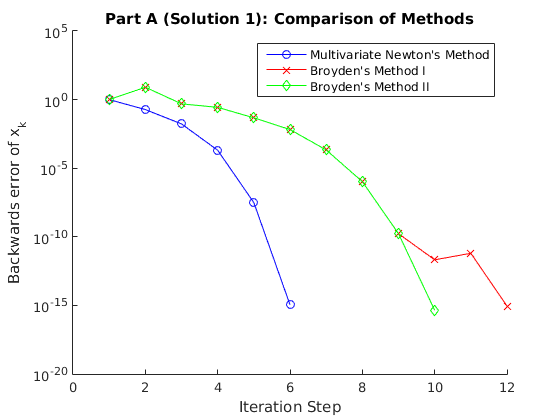
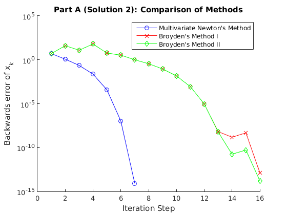
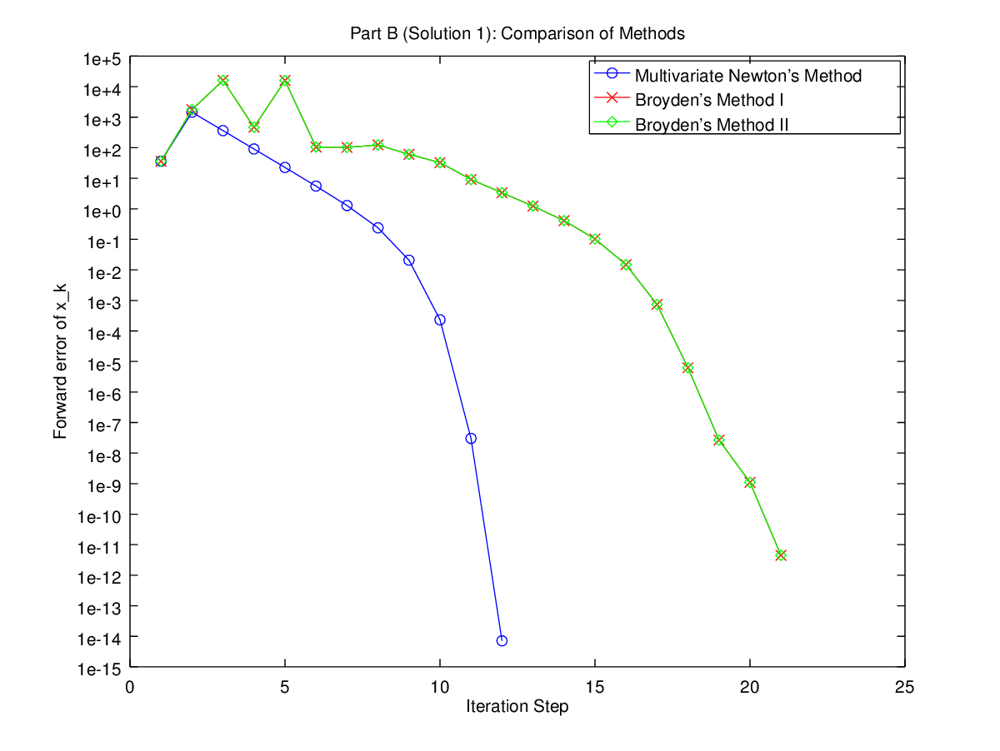
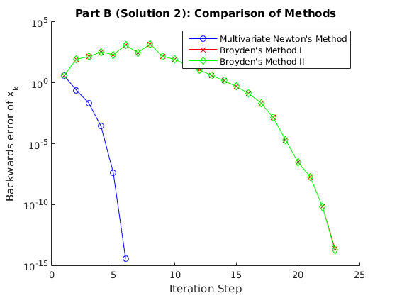

# MATH 446: Project 09

**Zachary Ferguson**

**April 04, 2017**

## Contents

1. Code
    1. Multivariate Newton's Method
    2. Broyden's Method I
    3. Broyden's Method II
    4. Main
2. Output
3. Figures

## Code

### Multivariate Newton's Method

```matlab
% Computes the roots of a vector valued function using the Newton's Method.
% Written by Zachary Ferguson

function xc = multivariate_newtons_method(f, df, x0, tol, figHandle)
    % Compute the root to f(x) using Newton's Method
    % Input:
    %   f - vector valued function to find the roots of
    %   df - Jacobian of f(x)
    %   x0 - intial guess
    %   tol - tolerance for the root
    % Output:
    %   xc - computed root to the function f(x).
    if nargin < 4
        tol = 1e-8;
    end
    if nargin < 5
        figHandle = false;
    end

    n_steps = 0;
    xc = x0;
    fe = norm(f(xc), inf);
    errors = [fe];
    while fe > tol
        s = df(xc) \ -f(xc);
        xc = xc + s;
        n_steps = n_steps + 1;
        fe = norm(f(xc), inf);
        errors = [errors fe];
    end
    fprintf('Number of steps to solve to %g accuracy: %d\n\n', tol, n_steps);

    if figHandle ~= false
        figure(figHandle);
        plot(1:size(errors, 2), errors, '-ob');
    end
end
```

###  Broyden's Method I

```matlab
% Computes the roots of a vector valued function using the Broden's Method I.
% Written by Zachary Ferguson

function xc = broydens_method_1(f, A0, x0, tol, figHandle)
    % Compute the root to f(x) using Newton's Method
    % Input:
    %   f - vector valued function to find the roots of
    %   A0 - inital approximation for the Jacobian of f(x)
    %   x0 - intial guess
    %   tol - tolerance for the root
    % Output:
    %   xc - computed root to the function f(x).
    if nargin < 4
        tol = 1e-8;
    end
    if nargin < 5
        figHandle = false;
    end

    n_steps = 0;

    xc = x0;
    A = A0;

    fe = norm(f(xc), inf);
    errors = [fe];
    while fe > tol
        s = A \ -f(xc);
        x_prev = xc;
        xc = xc + s;
        delta_f = f(xc) - f(x_prev);
        delta_x = xc - x_prev;
        A = A + ((delta_f - A * delta_x) * delta_x') / (delta_x' * delta_x);

        n_steps = n_steps + 1;
        fe = norm(f(xc), inf);
        errors = [errors fe];
    end
    fprintf('Number of steps to solve to %g accuracy: %d\n\n', tol, n_steps);

    % Display the errors per iteration.
    if figHandle ~= false
        figure(figHandle);
        plot(1:size(errors, 2), errors, '-xr');
    end
end
```

###  Broyden's Method II

```matlab
% Computes the roots of a vector valued function using the Broden's Method II.
% Written by Zachary Ferguson

function xc = broydens_method_2(f, B0, x0, tol, figHandle)
    % Compute the root to f(x) using Newton's Method
    % Input:
    %   f - vector valued function to find the roots of
    %   A0 - inital approximation for the inverse of the Jacobian of f(x)
    %   x0 - intial guess
    %   tol - tolerance for the root
    % Output:
    %   xc - computed root to the function f(x).
    if nargin < 4
        tol = 1e-8;
    end
    if nargin < 5
        figHandle = false;
    end

    n_steps = 0;

    xc = x0;
    B = B0; % B = A^-1

    fe = norm(f(xc), inf);
    errors = [fe];
    while fe > tol
        s = -B * f(xc); % = A^-1 * -f(xc)
        x_prev = xc;
        xc = xc + s;
        delta_f = f(xc) - f(x_prev); % Big Delta
        delta_x = xc - x_prev; % Little Delta
        B = B + ((delta_x - B * delta_f) * delta_x' * B) / ...
            (delta_x' * B * delta_f);

        n_steps = n_steps + 1;
        fe = norm(f(xc), inf);
        errors = [errors fe];
    end
    fprintf('Number of steps to solve to %g accuracy: %d\n\n', tol, n_steps);

    % Display the errors per iteration.
    if figHandle ~= false
        figure(figHandle);
        plot(1:size(errors, 2), errors, '-dg');
    end
end
```

### Main

```matlab
% MATH 446: Project 09
% Written by Zachary Ferguson

function main()
    fprintf('MATH 446: Project 09\nWritten by Zachary Ferguson\n\n');

    % Function and Jacobian used in part a:
    [f_a, df_a] = build_funtion_and_jacobian([1,1,0], 1, [1,0,1], 1, ...
        [0,1,1], 1);
    % Function and Jacobian used in part b:
    [f_b, df_b] = build_funtion_and_jacobian([1,-2,0], 5, [-2,2,-1], 5, ...
        [4,-2,3], 5);

    x0s_a = [  zeros(3, 1), 2*ones(3, 1)];
    x0s_b = [-2*ones(3, 1), 2*ones(3, 1)];

    x_stars_a = [1/3 * ones(3, 1), ones(3, 1)];
    x_stars_b = [(1:3)', [17/9; 22/9; 19/9]];

    titles = ['A', 'B'];
    figures = [];
    for i = 1:4
        figures = [figures figure];
        title(sprintf('Part %s (Solution %d): Comparison of Methods', ...
            titles(ceil(i / 2)), mod(i-1, 2) + 1));
        xlabel('Iteration Step');
        ylabel('Backwards error of x_k');
        set(gca, 'YScale', 'log');
        hold on;
    end

    tol = 1e-12;

    % Q5a
    run_method('5a', f_a, df_a, x0s_a, x_stars_a, ...
        'multivariate_newtons_method', tol, figures(1:2));

    % Q5b
    run_method('5b', f_b, df_b, x0s_b, x_stars_b, ...
        'multivariate_newtons_method', tol, figures(3:4));

    % Q9a
    run_method('9a', f_a, eye(3), x0s_a, x_stars_a, 'broydens_method_1', ...
        tol, figures(1:2));

    % Q9b
    run_method('9b', f_b, eye(3), x0s_b, x_stars_b, 'broydens_method_1', ...
        tol, figures(3:4));

    % Q11a
    run_method('11a', f_a, eye(3), x0s_a, x_stars_a, 'broydens_method_2', ...
        tol, figures(1:2));

    % Q11b
    run_method('11b', f_b, eye(3), x0s_b, x_stars_b, 'broydens_method_2', ...
        tol, figures(3:4));

    for i = 1:4
        figure(figures(i));
        legend(['Multivariate Newton''' 's Method'], ...
            ['Broyden''' 's Method I'], ...
            ['Broyden''' 's Method II']);
        hold off;
    end
end

function [f, df] = build_funtion_and_jacobian(c1, r1, c2, r2, c3, r3)
    % Build a function f(x) for the intersection of three circles.
    % Helper function for building f and df in Q5.
    % Function
    f = @(x) [(x(1)-c1(1))^2 + (x(2)-c1(2))^2 + (x(3)-c1(3))^2 - r1^2; ...
              (x(1)-c2(1))^2 + (x(2)-c2(2))^2 + (x(3)-c2(3))^2 - r2^2; ...
              (x(1)-c3(1))^2 + (x(2)-c3(2))^2 + (x(3)-c3(3))^2 - r3^2];
    % Jacobian
    df = @(x) [2*(x(1)-c1(1)) 2*(x(2)-c1(2)) 2*(x(3)-c1(3)); ...
               2*(x(1)-c2(1)) 2*(x(2)-c2(2)) 2*(x(3)-c2(3)); ...
               2*(x(1)-c3(1)) 2*(x(2)-c3(2)) 2*(x(3)-c3(3))];
end

function run_method(q_num, f, df, x0s, x_stars, method, tol, figures)
    fprintf('=== Q%s: ===\n\n', q_num);
    for i = 1:size(x0s, 2)
        fprintf('--- Solution Point %d: ---\nx0 = \n', i);
        disp(x0s(:, i));
        xc = feval(method, f, df, x0s(:, i), tol, figures(i));
        fprintf('xc = \n');
        disp(xc);

        fprintf('Backwards Error = %g\n', norm(f(xc), inf));
        fprintf('Forwards Error = %g\n\n', norm(xc - x_stars(:, i), inf));
    end
end
```

## Output

```
MATH 446: Project 09
Written by Zachary Ferguson

=== Q5a: ===

--- Solution Point 1: ---
x0 =
     0
     0
     0

Number of steps to solve to 1e-12 accuracy: 5

xc =
    0.3333
    0.3333
    0.3333

Backwards Error = 1.11022e-15
Forwards Error = 4.44089e-16

--- Solution Point 2: ---
x0 =
     2
     2
     2

Number of steps to solve to 1e-12 accuracy: 6

xc =
    1.0000
    1.0000
    1.0000

Backwards Error = 8.43769e-15
Forwards Error = 4.21885e-15

=== Q5b: ===

--- Solution Point 1: ---
x0 =
    -2
    -2
    -2

Number of steps to solve to 1e-12 accuracy: 11

xc =
    1.0000
    2.0000
    3.0000

Backwards Error = 7.10543e-15
Forwards Error = 7.77156e-16

--- Solution Point 2: ---
x0 =
     2
     2
     2

Number of steps to solve to 1e-12 accuracy: 5

xc =
    1.8889
    2.4444
    2.1111

Backwards Error = 3.55271e-15
Forwards Error = 2.22045e-15

=== Q9a: ===

--- Solution Point 1: ---
x0 =
     0
     0
     0

Number of steps to solve to 1e-12 accuracy: 11

xc =
    0.3333
    0.3333
    0.3333

Backwards Error = 8.88178e-16
Forwards Error = 4.44089e-16

--- Solution Point 2: ---
x0 =
     2
     2
     2

Number of steps to solve to 1e-12 accuracy: 15

xc =
    1.0000
    1.0000
    1.0000

Backwards Error = 1.38112e-13
Forwards Error = 6.90559e-14

=== Q9b: ===

--- Solution Point 1: ---
x0 =
    -2
    -2
    -2

Number of steps to solve to 1e-12 accuracy: 21

xc =
    1.0000
    2.0000
    3.0000

Backwards Error = 2.98428e-13
Forwards Error = 1.44773e-13

--- Solution Point 2: ---
x0 =
     2
     2
     2

Number of steps to solve to 1e-12 accuracy: 22

xc =
    1.8889
    2.4444
    2.1111

Backwards Error = 2.4869e-14
Forwards Error = 1.02141e-14

=== Q11a: ===

--- Solution Point 1: ---
x0 =
     0
     0
     0

Number of steps to solve to 1e-12 accuracy: 9

xc =
    0.3333
    0.3333
    0.3333

Backwards Error = 4.44089e-16
Forwards Error = 1.66533e-16

--- Solution Point 2: ---
x0 =
     2
     2
     2

Number of steps to solve to 1e-12 accuracy: 15

xc =
    1.0000
    1.0000
    1.0000

Backwards Error = 1.64313e-14
Forwards Error = 8.21565e-15

=== Q11b: ===

--- Solution Point 1: ---
x0 =
    -2
    -2
    -2

Number of steps to solve to 1e-12 accuracy: 21

xc =
    1.0000
    2.0000
    3.0000

Backwards Error = 3.94351e-13
Forwards Error = 1.94955e-13

--- Solution Point 2: ---
x0 =
     2
     2
     2

Number of steps to solve to 1e-12 accuracy: 22

xc =
    1.8889
    2.4444
    2.1111

Backwards Error = 1.77636e-14
Forwards Error = 5.55112e-15
```

## Figures

{ width=50% }
{ width=50% }
{ width=50% }
{ width=50% }
