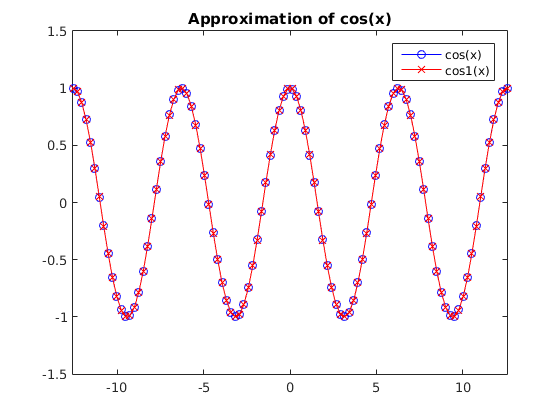

# MATH 446: Project 10

**Zachary Ferguson**

**April 11, 2017**

## Contents

1. Code
    1. Newton's Divided Differences
    2. Evaluating Newton's Divided Differences
    3. String of Newton's Divided Differences
    4. Approximation of Cosine
    4. Main
2. Output
3. Figures

## Code

### Newton's Divided Differences

```matlab
% Constructs a polynomial to interpolate between the provided points. Uses
% Newton's divided differences.
% Written by Zachary Ferguson

function coeffs = newtons_divided_differences(points)
    % Returns the coefficients for NDD.
    % Number of points
    n = size(points, 1);

    % Build Newton's triangle as a lower triangular matrix.
    v(:, 1) = points(:, 2);
    for j = 2:n
        for i = j:n
            v(i, j) = (v(i, j-1) - v(i-1, j-1))/(...
                points(i, 1) - points(i - j + 1, 1));
        end
    end

    % The diagonal of V are the coefficients of Newton's Divided Differences
    coeffs = diag(v);
end
```

### Evaluating Newton's Divided Differences

```matlab
% Evaluates Newton's Divided Difference given the coeffs and points.
% Written by Zachary Ferguson

function y = eval_newtdd(points, coeffs, x)
    % Evaluates Newton's Divided Difference at x given the original points and
    % coefficients.
    n = size(coeffs, 1);
    y = coeffs(n);
    for i = (n-1):-1:1
        y = y.* (x - points(i, 1)) + coeffs(i);
    end
end
```

### String of Newton's Divided Differences

```matlab
% Constructs a string representation for Newton's Divided Difference given the
% coeffs and points.
% Written by Zachary Ferguson

function s = newtdd_str(points, coeffs)
    % Builds a string representation of Newton's Divided Difference polynomial.
    n = size(coeffs, 1);
    s = coeffs(n);
    for i = (n-1):-1:1
        s = sprintf('(%s * (x - %g) + %g)', s, points(i, 1), coeffs(i));
    end
end
```

### Approximation of Cosine

```matlab
% Approximates cos curve with degree 3 polynomial

function [p, p_str] = build_cos1()
    % Input: x
    % Output: approximation for sin(x)
    % First calculate the interpolating polynomial and store coefficients
    b = (pi * (0:3)) / 6;
    yb = cos(b);
    % b holds base points
    cos1_coeffs = newtons_divided_differences([b' yb']);
    cos1 = @(x) eval_newtdd([b' yb'], cos1_coeffs, x);
    p = @(x) arrayfun(@(x) eval_cos(cos1, x), x);
    p_str = newtdd_str([b' yb'], cos1_coeffs);
end

function y = eval_cos(cos1, x)
    s = 1;
    x = mod(x, 2*pi); % COS repeats every 2 PI
    if x > pi
        x = 2*pi - x;
    end
    if x > pi/2
        x = pi - x;
        s = -1;
    end
    y = s * cos1(x);
end
```

### Main

```matlab
% MATH 446: Project 10
% Written by Zachary Ferguson

function main()
    fprintf('MATH 446: Project 10\nWritten by Zachary Ferguson\n\n');

    fprintf('=== Section 3.1 (Pg. 151) ===\n\n');
    [p, cos1_str] = build_cos1();

    figure;
    x = linspace(-4*pi, 4*pi);
    y = p(x);
    plot(x, cos(x), '-bo');
    hold on;
    plot(x, y, '-rx');
    hold off;
    axis([-4*pi 4*pi -1.5 1.5]);
    legend('cos(x)', 'cos1(x)');
    title('Approximation of cos(x)');

    fprintf('Q4:\n')
    fprintf('\tcos1(x) = %s\n', cos1_str);
    fprintf('\tFundamental Domain of cos: [0, PI/2]\n');
    fprintf('\tSee Figure 1 for plot of cos1.\n');
    fprintf('\tforward error of cos1 = %g\n', norm(cos(x) - y, inf));
    fprintf('\tSee Figure 2 for plot of actual error of cos1(x).\n\n');

    figure;
    x = linspace(0, pi/2);
    y = abs(cos(x) - p(x));
    plot(x, y, '-r');
    title('Error of cos1(x)');


    fprintf('=== Section 3.2 (Pg. 157) ===\n\n');

    % Data points for Section 3.2 Q1
    data = [0.6, 1.433329; ...
            0.7, 1.632316; ...
            0.8, 1.896481; ...
            0.9, 2.247908; ...
            1.0, 2.718282];

    coeffs = newtons_divided_differences(data);

    p_str = newtdd_str(data, coeffs);
    fprintf('Q1a:\n\tP(x) = %s\n', p_str);

    p = @(x) eval_newtdd(data, coeffs, x);
    fprintf('Q1b:\n\tP(0.82) = %g\n\tP(0.98) = %g\n', p(0.82), p(0.98));

    f = @(x) exp(x.^2);
    upper_error1 = upper_limit_error(data, 312*exp(1), 0.82);
    upper_error2 = upper_limit_error(data, 312*exp(1), 0.98);
    fprintf('Q1c:\n');
    fprintf('\tupper limit of error @ x = 0.82: %g\n', upper_error1);
    fprintf('\tactual error @ x = 0.82: %g\n', abs(f(0.82) - p(0.82)));
    fprintf('\tupper limit of error @ x = 0.98: %g\n', upper_error2);
    fprintf('\tactual error @ x = 0.98: %g\n', abs(f(0.98) - p(0.98)));

    fprintf('Q1d:\n\tSee Figures 3 and 4 for plots of error.\n');
    figure;
    x1 = linspace(0.5, 1);
    y1 = abs(p(x1) - f(x1));
    plot(x1, y1, '-r');
    title('Actual Error for Range [0.5, 1]');

    figure;
    x2 = linspace(0, 2);
    y2 = abs(p(x2) - f(x2));
    plot(x2, y2, '-b');
    title('Actual Error for Range [0, 2]');
end

function ue = upper_limit_error(points, f_prime_c, x)
    n = size(points, 1);
    prod = 1;
    for i = 1:n
        prod = prod * (x - points(i, 1));
    end
    ue = abs(prod / factorial(n) * f_prime_c);
end
```

## Output

```
MATH 446: Project 10
Written by Zachary Ferguson

=== Section 3.1 (Pg. 151) ===

Q4:
	cos1(x) = (((1.138719e-01 * (x - 1.0472) + -0.42321) * (x - 0.523599) +
        -0.255873) * (x - 0) + 1)
	Fundamental Domain of cos: [0, PI/2]
	See Figure 1 for plot of cos1.
	forward error of cos1 = 0.00239175
	See Figure 2 for plot of actual error of cos1(x).

=== Section 3.2 (Pg. 157) ===

Q1a:
	P(x) = ((((4.000417e+00 * (x - 0.9) + 3.68067) * (x - 0.8) + 3.2589) *
        (x - 0.7) + 1.98987) * (x - 0.6) + 1.43333)
Q1b:
	P(0.82) = 1.95891
	P(0.98) = 2.61285
Q1c:
	upper limit of error @ x = 0.82: 5.37359e-05
	actual error @ x = 0.82: 2.33485e-05
	upper limit of error @ x = 0.98: 0.000216572
	actual error @ x = 0.98: 0.000106605
Q1d:
	See Figures 3 and 4 for plots of error.
```

## Figures

{ width=50% }
{ width=50% }
![Q1d: Actual Error for Range [0.5, 1]](Figure3.png){ width=50% }
![Q1d: Actual Error for Range [0, 2]](Figure4.png){ width=50% }
