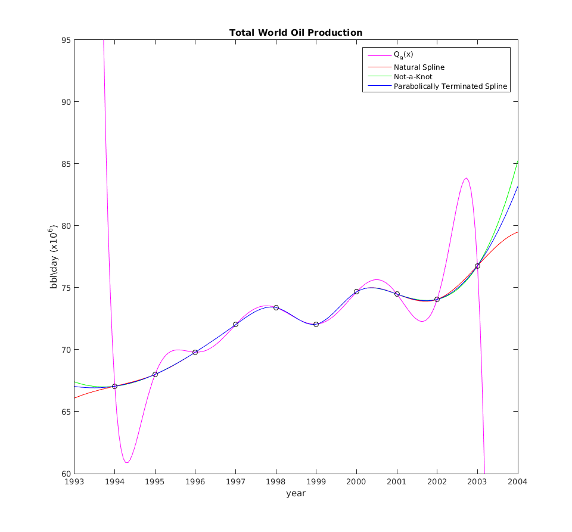

# MATH 446: Project 11

**Zachary Ferguson**

**April 25, 2017**

## Contents

1. Code
    1. Newton's Divided Differences
    2. Evaluating Newton's Divided Differences
    3. String of Newton's Divided Differences
    4. Cubic Spline
    5. Evaluating Cubic Spline
    6. Main
2. Output
3. Figures

## Code

### Newton's Divided Differences

```matlab
% Constructs a polynomial to interpolate between the provided points. Uses
% Newton's divided differences.
% Written by Zachary Ferguson

function coeffs = newtons_divided_differences(points)
    % Returns the coefficients for NDD.
    % Number of points
    n = size(points, 1);

    % Build Newton's triangle as a lower triangular matrix.
    v(:, 1) = points(:, 2);
    for j = 2:n
        for i = j:n
            v(i, j) = (v(i, j-1) - v(i-1, j-1))/(...
                points(i, 1) - points(i - j + 1, 1));
        end
    end

    % The diagonal of V are the coefficients of Newton's Divided Differences
    coeffs = diag(v);
end
```

### Evaluating Newton's Divided Differences

```matlab
% Evaluates Newton's Divided Difference given the coeffs and points.
% Written by Zachary Ferguson

function y = eval_newtdd(points, coeffs, x)
    % Evaluates Newton's Divided Difference at x given the original points and
    % coefficients.
    n = size(coeffs, 1);
    y = coeffs(n);
    for i = (n-1):-1:1
        y = y.* (x - points(i, 1)) + coeffs(i);
    end
end
```

### String of Newton's Divided Differences

```matlab
% Constructs a string representation for Newton's Divided Difference given the
% coeffs and points.
% Written by Zachary Ferguson

function s = newtdd_str(points, coeffs)
    % Builds a string representation of Newton's Divided Difference polynomial.
    n = size(coeffs, 1);
    s = sprintf('%g', coeffs(n));
    for i = (n-1):-1:1
        s = sprintf('(%s * (x - %g) + %g)', s, points(i, 1), coeffs(i));
    end
end
```

### Approximation of Cosine

```matlab
% Approximates cos curve with degree 3 polynomial

function [p, p_str] = build_cos1()
    % Input: x
    % Output: approximation for sin(x)
    % First calculate the interpolating polynomial and store coefficients
    b = (pi * (0:3)) / 6;
    yb = cos(b);
    % b holds base points
    cos1_coeffs = newtons_divided_differences([b' yb']);
    cos1 = @(x) eval_newtdd([b' yb'], cos1_coeffs, x);
    p = @(x) arrayfun(@(x) eval_cos(cos1, x), x);
    p_str = newtdd_str([b' yb'], cos1_coeffs);
end

function y = eval_cos(cos1, x)
    s = 1;
    x = mod(x, 2*pi); % COS repeats every 2 PI
    if x > pi
        x = 2*pi - x;
    end
    if x > pi/2
        x = pi - x;
        s = -1;
    end
    y = s * cos1(x);
end
```

### Cubic Spline

```matlab
% Calculates coefficents for a cubic spline
% Written by Zachary Ferguson

function coeffs = cubic_spline(points, endpoint_method, endpoint_args)
    % Calculates coefficients of cubic spline
    % Input:
    %   x,y vectors of data points plus two optional extra data v1, vn
    % Output:
    %   matrix of coefficients b1,c1,d1;b2,c2,d2;...
    if nargin < 2
        endpoint_method = 'natural';
    end

    n = size(points, 1);
    v1 = 0;
    vn = 0;


    deltas = points(2:n, :) - points(1:n-1, :);
    dx = deltas(:, 1);
    dy = deltas(:, 2);

    A = diag([dx(1:n-2); 0], -1) + ...
      diag([0; 2*(dx(1:n-2) + dx(2:n-1)); 0]) + ...
      diag([0; dx(2:n-1)], 1);

    r = [0; 3 * (dy(2:n-1)./dx(2:n-1) - dy(1:n-2)./dx(1:n-2)); 0]; % right-hand side

    % Set endpoint conditions
    % Use only one of following 5 pairs:
    if strcmp(endpoint_method, 'natural') == 1
        A(1,1) = 1; % natural spline conditions
        A(n,n) = 1;
    elseif strcmp(endpoint_method, 'curvature-adj')
        A(1,1) = 2;
        r(1) = endpoint_args(1); % curvature-adj conditions
        A(n,n) = 2;
        r(n) = endpoint_args(2);
    elseif strcmp(endpoint_method, 'clamped')
        A(1,1:2)=[2*dx(1) dx(1)];
        r(1)=3*(dy(1)/dx(1)-endpoint_args(1)); %clamped
        A(n,n-1:n)=[dx(n-1) 2*dx(n-1)];
        r(n)=3*(endpoint_args(2)-dy(n-1)/dx(n-1));
    elseif strcmp(endpoint_method, 'parabola') && n >= 3
        A(1, 1:2)   = [1 -1]; % parabol-term conditions, for n>=3
        A(n, n-1:n) = [1 -1];
    elseif strcmp(endpoint_method, 'not-a-knot') && n >= 4
        A(1,1:3)=[dx(2) -(dx(1)+dx(2)) dx(1)]; % not-a-knot, for n>=4
        A(n,n-2:n)=[dx(n-1) -(dx(n-2)+dx(n-1)) dx(n-2)];
    else
        error('Invalid endpoint method.');
    end

    coeffs = zeros(n,3);
    coeffs(:,2) = A\r; % solve for c coefficients
    coeffs(1:n-1,1) = dy./dx - (dx/3).*(2 * coeffs(1:n-1, 2) + coeffs(2:n, 2));
    coeffs(1:n-1,3) = (coeffs(2:n, 2) - coeffs(1:n-1, 2))./(3*dx);
    coeffs = coeffs(1:n-1, :);
end
```

### Evaluating Cubic Spline

```matlab
% Evaluates the given cubic spline at the x value.
% Written by Zachary Ferguson

function y = eval_cubic_spline(points, coeffs, x)
    % Evaluates the given cubic spline at the x value.
    % Input: x,y vectors of data points, coefficients of spline, x value(s)
    % Output: y values for given x values
    y = [];

    np = size(points, 1);
    nx = size(x, 2);
    for i = 1:nx
        if x(i) < points(1, 1)
            px = points(1, 1);
            j = 1;
        elseif x(i) >= points(end, 1)
            px = points(np-1, 1);
            j = np - 1;
        else
            for j = 2:np
                if x(i) < points(j, 1)
                    px = points(j-1, 1);
                    j = j - 1;
                    break;
                end
            end
        end
        dx = x(i) - px;
        yi = coeffs(j,3)*dx; % evaluate using nested multiplication
        yi = (yi+coeffs(j,2)).*dx;
        yi = (yi+coeffs(j,1)).*dx + points(j, 2);
        y  = [y; yi];
    end
end
```

### Main

```matlab
% MATH 446: Project 11
% Written by Zachary Ferguson

function main()
    fprintf('MATH 446: Project 11\nWritten by Zachary Ferguson\n\n');

    fprintf('=== Section 3.2 (Pg. 157) ===\n\n');

    points = [1994, 67.052;
              1995, 68.008;
              1996, 69.803;
              1997, 72.024;
              1998, 73.400;
              1999, 72.063;
              2000, 74.669;
              2001, 74.487;
              2002, 74.065;
              2003, 76.777];

    coeffs = newtons_divided_differences(points);
    fprintf('--- Q3 ---\n\nPoints:\n');
    disp(points);
    p_str = newtdd_str(points, coeffs);
    fprintf('\nP(x) = %s\n', p_str);

    figure;
    x = linspace(1993, 2004, 200);
    y = eval_newtdd(points, coeffs, x);
    plot(x, y, '-m');
    hold on;

    fprintf('\nEstimate of oil production per day in 2010: %g\n', ...
        eval_newtdd(points, coeffs, 2010));

    fprintf('\nThis interpolation exhibits the Runge phenomenon.\n');
    fprintf('This interpolating polynomial is a bad model of the data\n');
    fprintf('because it does not model the data after the given points. \n');
    fprintf('This model does not transition smoothly from point to point.\n\n');

    fprintf('\n=== Section 3.4 (Pg. 178) ===\n\n');

    fprintf('--- Q13 ---\n\n');

    natural_coeffs = cubic_spline(points, 'natural');
    fprintf('Natural Spline:\n\n      a    |    b    |    c\n');
    disp(natural_coeffs);
    not_a_knot_coeffs = cubic_spline(points, 'not-a-knot');
    fprintf('\nNot-a-Knot Spline:\n\n      a     |     b    |    c\n');
    disp(not_a_knot_coeffs);
    parabola_coeffs = cubic_spline(points, 'parabola');
    fprintf('\Parabolically Terminated Spline:\n\n      a    |    b    |    c\n');
    disp(parabola_coeffs);

    y = eval_cubic_spline(points, natural_coeffs, x);
    plot(x, y, '-r');
    y = eval_cubic_spline(points, not_a_knot_coeffs, x);
    plot(x, y, '-g');
    y = eval_cubic_spline(points, parabola_coeffs, x);
    plot(x, y, '-b');
    plot(points(:, 1), points(:, 2), 'ok')
    hold off;
    axis([1993 2004 60 95]);
    legend('Q_9(x)', 'Natural Spline', 'Not-a-Knot', 'Parabolically Terminated Spline');
    title('Total World Oil Production');
    xlabel('year');
    ylabel('bbl\\day (x10^6)');
end
```

## Output

```
MATH 446: Project 11
Written by Zachary Ferguson

=== Section 3.2 (Pg. 157) ===

--- Q3 ---

Points:
   1.0e+03 *

    1.9940    0.0671
    1.9950    0.0680
    1.9960    0.0698
    1.9970    0.0720
    1.9980    0.0734
    1.9990    0.0721
    2.0000    0.0747
    2.0010    0.0745
    2.0020    0.0741
    2.0030    0.0768


P(x) = (((((((((-0.000735246 * (x - 2002) + 0.00286461) * (x - 2001) + -0.00791508) *
(x - 2000) + 0.0123056) * (x - 1999) + 0.002175) * (x - 1998) + -0.03575) *
(x - 1997) + -0.0688333) * (x - 1996) + 0.4195) * (x - 1995) + 0.956) *
(x - 1994) + 67.052)

Estimate of oil production per day in 2010: -1.95165e+06

This interpolation exhibits the Runge phenomenon.
This interpolating polynomial is a bad model of the data
because it does not model the data after the given points.
This model does not transition smoothly from point to point.


=== Section 3.4 (Pg. 178) ===

--- Q13 ---

Natural Spline:

      a    |    b    |    c
    0.7577         0    0.1983
    1.3527    0.5950   -0.1526
    2.0847    0.1370   -0.0007
    2.3566    0.1348   -1.1154
   -0.7199   -3.2113    2.5943
    0.6402    4.5715   -2.6057
    1.9661   -3.2455    1.0974
   -1.2327    0.0467    0.7641
    1.1528    2.3388   -0.7796


Not-a-Knot Spline:

      a     |     b    |    c
    0.3794    0.6552   -0.0786
    1.4541    0.4195   -0.0786
    2.0574    0.1838   -0.0202
    2.3645    0.1233   -1.1117
   -0.7242   -3.2119    2.5991
    0.6493    4.5854   -2.6287
    1.9340   -3.3007    1.1847
   -1.1133    0.2534    0.4379
    0.7071    1.5670    0.4379


Parabolically Terminated Spline:

      a    |    b    |    c
    0.4867    0.4693         0
    1.4253    0.4693   -0.0996
    2.0651    0.1706   -0.0147
    2.3622    0.1265   -1.1126
   -0.7228   -3.2114    2.5973
    0.6461    4.5803   -2.6204
    1.9455   -3.2808    1.1533
   -1.1562    0.1791    0.5552
    0.8674    1.8446    0.0000
```

## Figures

{ width=100% }
