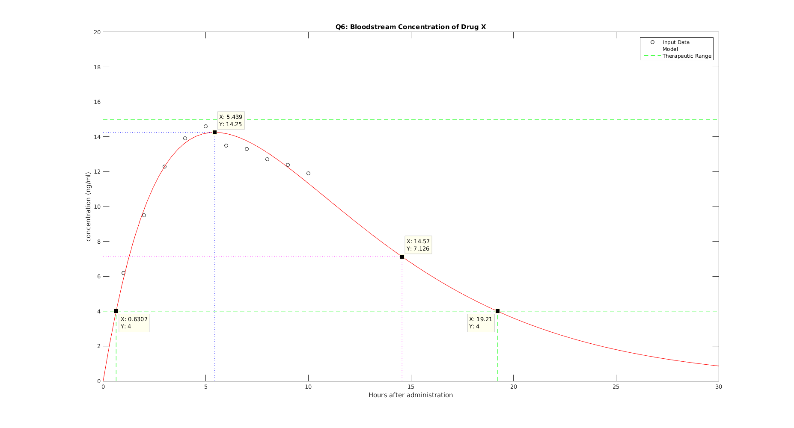
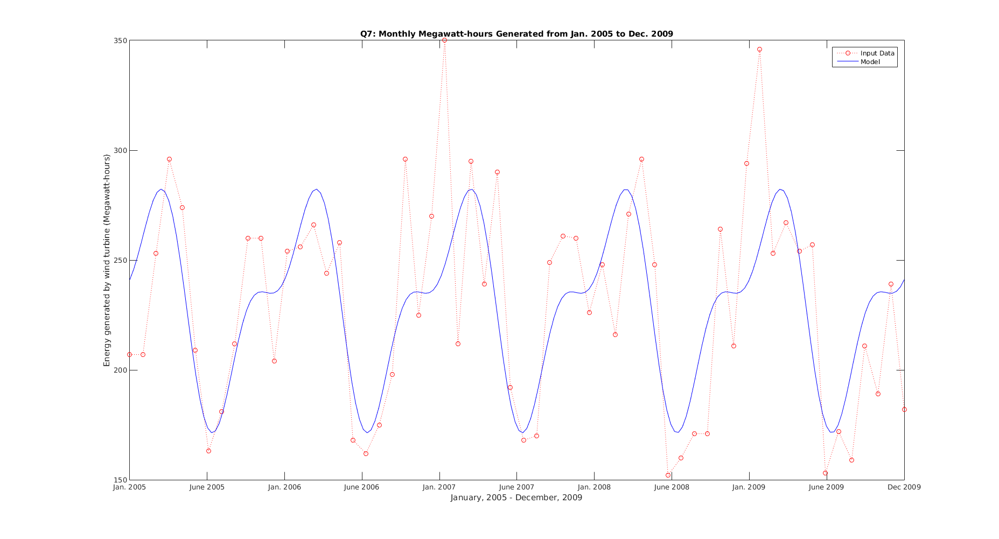

# MATH 446: Project 12

**Zachary Ferguson**

**May 02, 2017**

## Contents

1. Code
    1. Main
2. Output
3. Figures

## Code

### Main

```matlab
% MATH 446: Project 12
% Written by Zachary Ferguson

function main()
    fprintf('MATH 446: Project 12\nWritten by Zachary Ferguson\n\n');

    % Q6
    q6_points = [ 1,  6.2;  2,  9.5;  3, 12.3;  4, 13.9;  5, 14.6;
                  6, 13.5;  7, 13.3;  8, 12.7;  9, 12.4; 10, 11.9];

    n = size(q6_points, 1);

    A = [ones(n, 1) q6_points(:, 1)];
    b = log(q6_points(:, 2)) - log(q6_points(:, 1));

    kc2 = (A' * A) \ (A' * b);
    c1 = exp(kc2(1));
    c2 = kc2(2);

    opts = optimset('Diagnostics','off', 'Display','off');
    f  = @(t) c1 * exp(c2 * t).* t;
    fp = @(t) c1 * exp(c2 * t).* (c2 * t + 1);
    max_t = fsolve(fp, 1, opts);
    max_y = f(max_t);

    half_t = fsolve(@(t) f(t) - max_y / 2.0, max_t + 1, opts);
    half_y = f(half_t);

    half_life = abs(half_t - max_t);

    min_tr = fsolve(@(t) f(t) - 4, 0, opts);
    max_tr = fsolve(@(t) f(t) - 4, 15, opts);

    fprintf('=== Q6 ===\n\nPoints:\n')

    disp(q6_points);
    fprintf('Model: f(t) = %g * t * e^(%g * t)\n\n', c1, c2)
    fprintf('Maximum blood stream concentration: %g ng/ml\n', max_y);
    fprintf('Half-life of the drug: %g hours\n', half_life);
    fprintf('Start of therapeutic range: %g hours\n', min_tr);
    fprintf('End of therapeutic range: %g hours\n', max_tr);
    fprintf('Duration of therapeutic range: %g hours\n', abs(max_tr-min_tr));

    %--------------------------------------------------------------------------
    % Figure 1
    figure;

    % Plot the input points
    plot(q6_points(:, 1), q6_points(:, 2), 'ok');
    hold on;

    % Plot the model
    x = linspace(0, 30);
    y = f(x);
    plot(x, y, '-r');

    % Plot Max and Min Therapeutic Range
    plot([0 30], [15 15], '--g', [0 30], [4 4], '--g');
    plot([min_tr, min_tr], [0, 4], '--g', [max_tr, max_tr], [0, 4], '--g', ...
        min_tr, 4, 'xg', max_tr, 4, 'xg');

    % Plot the Max and Half
    plot([0 max_t], [max_y max_y], ':b', [max_t max_t], [0 max_y], ':b', ...
        max_t, max_y, 'xb');
    plot([0 half_t], [half_y half_y], ':m', [half_t half_t], [0 half_y], ...
        ':m', half_t, half_y, 'xm');
    hold off;

    axis([0, 30, 0, 20]);
    legend('Input Data', 'Model', 'Therapeutic Range');
    title('Q6: Bloodstream Concentration of Drug X');
    xlabel('Hours after administration');
    ylabel('concentration (ng/ml)');

    % -------------------------------------------------------------------------
    % Q7
    q7_points = [207 207 253 296 274 209 163 181 212 260 260 204 254 256 ...
        266 244 258 168 162 175 198 296 225 270 350 212 295 239 290 192 ...
        168 170 249 261 260 226 248 216 271 296 248 152 160 171 171 264 ...
        211 294 346 253 267 254 257 153 172 159 211 189 239 182];
    q7_points = [linspace(0, 5, 5*12)', q7_points'];

    n = size(q7_points, 1);

    A = [ones(n, 1), cos(2*pi*q7_points(:, 1)), sin(2*pi*q7_points(:, 1)), ...
        cos(4*pi*q7_points(:, 1))];
    b = q7_points(:, 2);

    c = (A' * A) \ (A' * b);

    f = @(t) c(1) + c(2) * cos(2*pi*t) + c(3) * sin(2*pi*t) + ...
        c(4) * cos(4*pi*t);


    fprintf('\n=== Q7 ===\n\nPoints: See windmill.txt\n\n')

    fprintf('Model: f(t) = %g + %g * cos(2*pi*t) + %g* sin(2*pi*t) + %g * cos(4*pi*t)\n', ...
        c(1), c(2), c(3), c(4));

    fprintf([...
        '\nThis model accurately captures the periodic cycle of energy\n' ...
        'usage. The model also represents the decrease in energy usage\n' ...
        'during temperate months. Energy usage decreases in spring as\n' ...
        'users turn off central heating. Energy usage increases in the\n' ...
        'summer as users start to turn on air conditioning. The presented\n'...
        'model captures this trend.\n']);

    %--------------------------------------------------------------------------
    % Figure 1
    figure;
    plot(q7_points(:, 1), q7_points(:, 2), ':ro');
    hold on;
    x = linspace(0, 5, 200);
    y = f(x);
    plot(x, y, '-b');
    hold off;

    % axis([0, 5, 0, 400]);
    legend('Input Data', 'Model');
    title('Q7: Monthly Megawatt-hours Generated from Jan. 2005 to Dec. 2009');
    set(gca, 'xtick', linspace(0, 5, 11), 'xticklabel', {'Jan. 2005', 'June 2005', ...
        'Jan. 2006', 'June 2006', 'Jan. 2007', 'June 2007', 'Jan. 2008', ...
        'June 2008', 'Jan. 2009', 'June 2009', 'Dec 2009'})
    xlabel('January, 2005 - December, 2009');
    ylabel('Energy generated by wind turbine (Megawatt-hours)');
end
```

## Output

```
MATH 446: Project 12
Written by Zachary Ferguson

=== Q6 ===

Points:
    1.0000    6.2000
    2.0000    9.5000
    3.0000   12.3000
    4.0000   13.9000
    5.0000   14.6000
    6.0000   13.5000
    7.0000   13.3000
    8.0000   12.7000
    9.0000   12.4000
   10.0000   11.9000

Model: f(t) = 7.12203 * t * e^(-0.183849 * t)

Maximum blood stream concentration: 14.2511 ng/ml
Half-life of the drug: 9.12894 hours
Start of therapeutic range: 0.630686 hours
End of therapeutic range: 19.2145 hours
Duration of therapeutic range: 18.5838 hours

=== Q7 ===

Points: See windmill.txt

Model: f(t) = 229.711 + 33.5316 * cos(2*pi*t) + 25.5689* sin(2*pi*t) + -22.1627 * cos(4*pi*t)

This model accurately captures the periodic cycle of energy
usage. The model also represents the decrease in energy usage
during temperate months. Energy usage decreases in spring as
users turn off central heating. Energy usage increases in the
summer as users start to turn on air conditioning. The presented
model captures this trend.
```

## Figures

{ width=100% }
{ width=100% }
